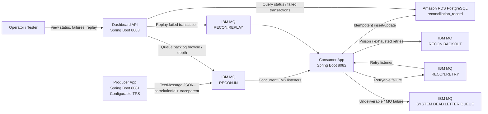
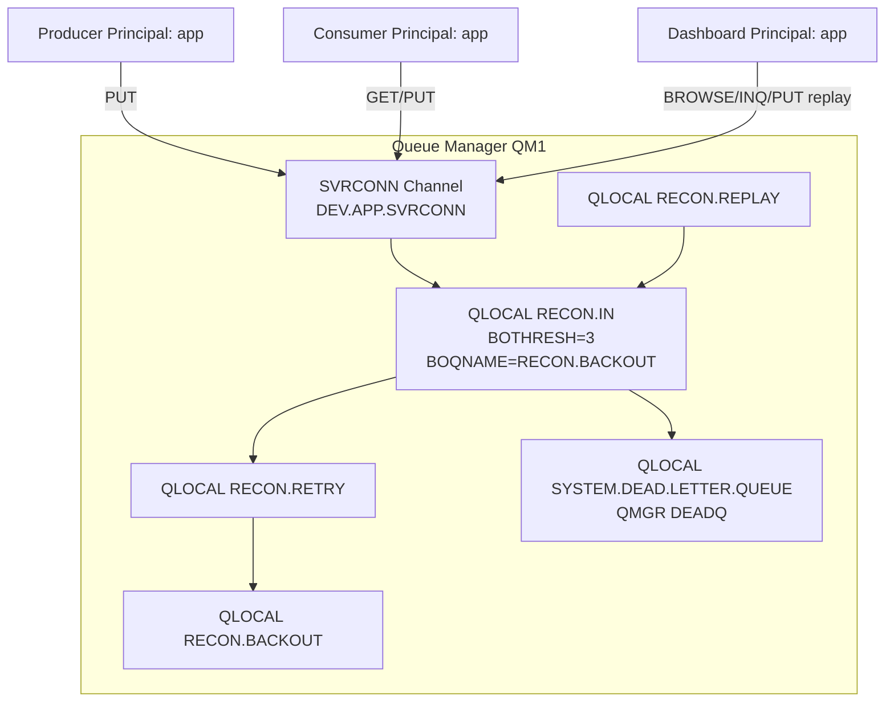
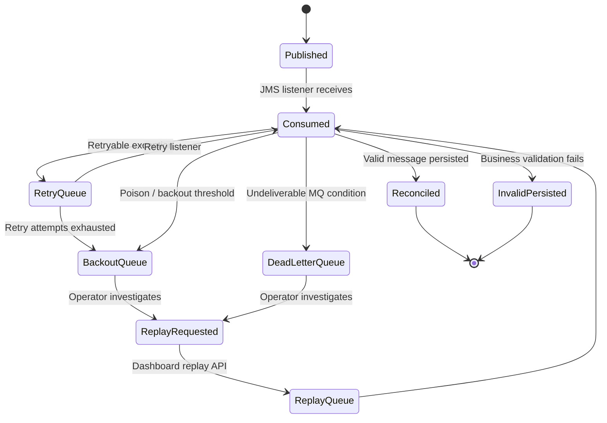
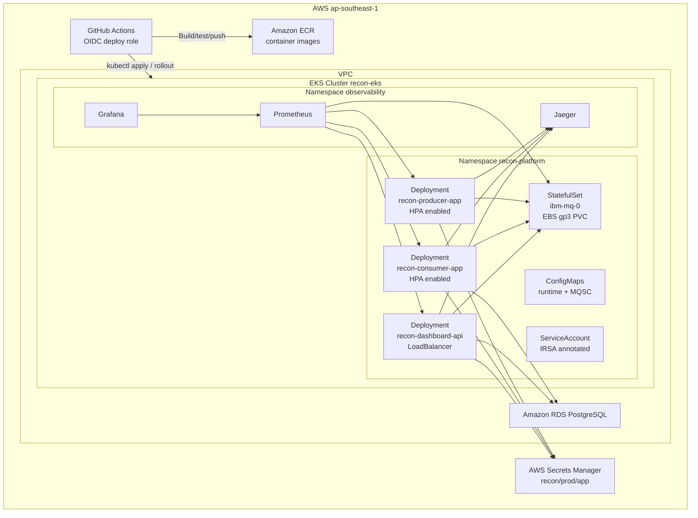
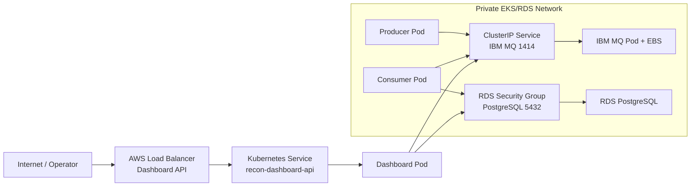
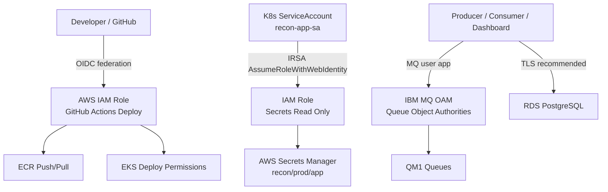
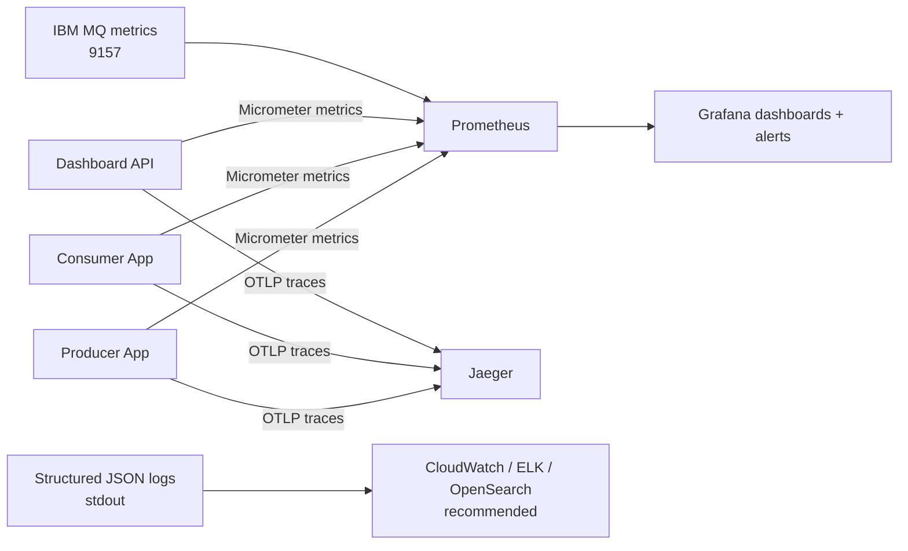
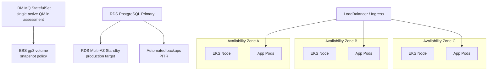
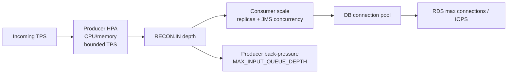

# Phase 4 - Architecture and Design Walkthrough

This document describes the production architecture for the NTT reconciliation platform. It is written for a Principal Engineer / Architect review and maps directly to the Phase 4 assessment expectations.

## Architecture Artifacts

| Artifact | Location | Purpose |
|---|---|---|
| Draw.io architecture file | `E:\workspace\architecture\recon-platform-phase4.drawio` | Open in Draw.io / diagrams.net for editable architecture diagrams |
| Mermaid diagrams | This document | Fast reviewable diagrams in GitHub Markdown |
| NotebookLM / Gamma prompts | `E:\workspace\PHASE4_NOTEBOOKLM_GAMMA_PROMPTS.md` | AI-assisted architecture and presentation generation prompts |

## System Context

The platform is a cloud-native reconciliation system deployed on AWS EKS. It uses IBM MQ for durable asynchronous messaging, Amazon RDS PostgreSQL for reconciliation state, AWS Secrets Manager for confidential runtime configuration, and Prometheus/Grafana/Jaeger for observability.

The three application services are intentionally separated:

| Application | Responsibility | Port |
|---|---|---|
| `recon-producer-app` | Generates valid/invalid reconciliation transactions and publishes to IBM MQ | `8081` |
| `recon-consumer-app` | Consumes MQ messages, performs reconciliation, persists to PostgreSQL, handles retries/idempotency | `8082` |
| `recon-dashboard-api` | Exposes reconciliation status, failures, queue visibility, replay API, health endpoints | `8083` |

## 1. End-to-End Message Flow



### Flow Notes

- Producer creates random reconciliation transactions continuously with conservative TPS defaults in EKS.
- Every message carries a `correlationId`, `traceId`, and W3C `traceparent`.
- Consumer processes messages concurrently, but idempotency is enforced using `correlation_id`.
- Invalid business payloads are persisted as `INVALID`, not lost.
- Retryable failures move through retry/backout patterns.
- Dashboard reads DB state and queue depth and supports message replay.

## 2. IBM MQ Topology



### MQ Security and OAM

MQ authority is intentionally object-level:

| Object | Required Authority |
|---|---|
| Queue Manager | `CONNECT`, `INQ`, `DSP` |
| Input / Retry queues | `PUT`, `GET`, `BROWSE`, `INQ`, `DSP` |
| Backout / DLQ | `PUT`, `GET`, `BROWSE`, `INQ`, `DSP` |

The real deployment encountered `MQRC 2035`, which is documented here:

```text
E:\workspace\PHASE2_MQRC2035_FAILURE_ANALYSIS.md
```

This is a strong operational demonstration because the failure was diagnosed using logs, fixed by OAM authorities, and validated by end-to-end message processing.

## 3. Retry and DLQ Architecture



### Failure Handling

| Failure | Handling |
|---|---|
| Duplicate message | Idempotency check by `correlation_id` and database uniqueness |
| Database deadlock | Exponential backoff retry, then retry queue if needed |
| Slow database | Bulkhead + circuit breaker prevent uncontrolled thread exhaustion |
| MQ outage | Producer/consumer retry via JMS recovery; health remains available |
| Consumer crash | Kubernetes restarts pod; uncommitted MQ message is redelivered |
| Poison message | Retry limit/backout route protects main processing path |
| Authorization failure | `MQRC 2035` logged without secrets; OAM runbook fixes authorities |

## 4. Kubernetes Deployment Architecture



### Kubernetes Design

| Capability | Implementation |
|---|---|
| Stateless app scaling | Deployments for producer, consumer, dashboard |
| Stateful MQ | StatefulSet + EBS gp3 PVC |
| Runtime config | ConfigMaps for non-secret values |
| Secret handling | AWS Secrets Manager + IRSA; MQ runtime K8s Secret synced from AWS |
| Auto-recovery | Liveness/readiness probes and Deployment restart policy |
| Rolling deploy | `RollingUpdate` with controlled surge/unavailable settings |
| Scaling | HPA manifests for app workloads |
| Availability | PDBs reduce voluntary disruption risk |
| Isolation | NetworkPolicies restrict traffic paths |

## 5. Cloud Networking



### Network Boundaries

- Dashboard API can be exposed externally for assessment access.
- IBM MQ remains internal via ClusterIP.
- RDS is private and allows PostgreSQL only from the EKS cluster security group.
- Secrets Manager is accessed through AWS API using IRSA credentials.
- Observability tools may be temporarily exposed for demo, but production should use authenticated ingress and TLS.

## 6. Security Model



### Security Decisions

| Decision | Rationale |
|---|---|
| AWS Secrets Manager instead of properties files | Keeps credentials out of Git and image layers |
| IRSA instead of node-role secret access | Limits blast radius to the application service account |
| MQ OAM authority | Separates authentication from object-level authorization |
| Non-root containers | Reduces container breakout risk |
| NetworkPolicies | Restricts unnecessary pod-to-pod traffic |
| No real secrets in repo | Supports public or shared assessment repository |
| Structured logs without passwords | Troubleshooting evidence without credential leakage |

## 7. Observability Stack



### Signals

| Signal | Examples |
|---|---|
| Metrics | TPS, publish failures, consumed count, retry count, backout count, queue depth |
| Logs | `event=transaction_published`, `event=transaction_consumed`, `mqrc=2035` |
| Traces | W3C `traceparent` propagated from producer through MQ to consumer |
| Alerts | Queue backlog, retry surge, error-rate spike, pod restarts, DB latency |

## 8. HA and DR Design



### HA/DR Strategy

| Layer | Assessment Implementation | Production Recommendation |
|---|---|---|
| Producer | Multiple replicas supported; conservative default | HPA with TPS partitioning or leader election if strict single generator needed |
| Consumer | Multiple replicas and JMS concurrency | Scale by queue depth with KEDA or custom MQ scaler |
| Dashboard | Stateless deployment | Multi-replica behind ALB with WAF/TLS |
| IBM MQ | StatefulSet with persistent EBS volume | IBM MQ Native HA / multi-instance queue manager across AZs |
| PostgreSQL | RDS PostgreSQL | Multi-AZ, PITR, read replica for reporting |
| Observability | In-cluster Prometheus/Grafana/Jaeger | Managed Prometheus/Grafana, retained logs, trace sampling policy |
| Disaster recovery | EBS/RDS snapshots | Cross-region backup and tested restore runbooks |

## 9. Scaling Strategy



### Scaling Controls

| Control | Purpose |
|---|---|
| `PRODUCER_TPS` | Controls generated transaction rate |
| `PRODUCER_INTERVAL_MS` | Controls production cadence |
| `MAX_INPUT_QUEUE_DEPTH` | Prevents unbounded MQ backlog |
| `CONSUMER_CONCURRENCY` | Controls concurrent JMS processing threads |
| `CONSUMER_MAX_CONCURRENCY` | Caps listener expansion |
| HPA | Scales pods based on resource pressure |
| Bulkhead | Prevents DB overload from unlimited concurrent calls |
| Circuit breaker | Stops hammering unhealthy DB dependency |

## Design Decisions and Trade-Offs

| Decision | Benefit | Trade-Off |
|---|---|---|
| IBM MQ as durable broker | Enterprise banking fit, guaranteed delivery, MQ features | Operational complexity and OAM/security setup |
| Separate producer, consumer, dashboard apps | Clear ownership and scaling boundaries | More deployments and config coordination |
| PostgreSQL/RDS as system of record | Strong consistency and SQL reporting | DB becomes a scaling bottleneck if not sized well |
| Idempotency by correlation ID | Safe duplicate handling | Requires strict correlation ID generation and DB uniqueness |
| Retry queues instead of immediate endless retry | Isolates transient failures | Requires replay and operations process |
| Backout/DLQ | Protects mainline processing from poison messages | Requires monitoring and manual/automated remediation |
| In-cluster MQ for assessment | Easy to demonstrate in Kubernetes | Production should evaluate IBM MQ managed/native HA topology |
| Raw Kubernetes manifests | Transparent operational detail | Helm/Kustomize overlays may be cleaner at scale |
| AWS Secrets Manager + IRSA | Production-grade credential handling | Requires IAM/OIDC setup |

## Failure Isolation

| Failure Domain | Isolation Mechanism |
|---|---|
| Producer overload | Producer TPS and back-pressure controls |
| Consumer overload | JMS concurrency cap, HPA, bulkhead |
| DB slowness | Bulkhead + circuit breaker + retry |
| Poison message | Retry/backout queue separation |
| MQ authorization issue | MQRC 2035 logging and OAM runbook |
| MQ outage | Durable queue semantics and retry on reconnect |
| Consumer crash | Kubernetes restart and MQ redelivery |
| Dashboard failure | Does not stop producer/consumer flow |

## Performance Bottlenecks

| Bottleneck | Risk | Mitigation |
|---|---|---|
| RDS write throughput | Consumers can outpace DB writes | Tune connection pool, batch where safe, scale RDS IOPS/instance |
| MQ queue depth | Backlog grows during DB/MQ downstream issues | Back-pressure and queue-depth alerts |
| Consumer concurrency | Too high can cause DB contention/deadlocks | Cap concurrency and tune against DB capacity |
| Large invalid/retry volume | Retry queues grow and hide root causes | Alert on retry/backout rate, automate triage |
| Dashboard queries | Reporting queries can affect write workload | Add indexes, pagination, read replica for reporting |
| Observability cardinality | High-cardinality metrics increase cost | Avoid transaction IDs as metric labels |

## Capacity Planning

Use these planning inputs:

| Variable | Meaning |
|---|---|
| `T` | Target steady-state TPS |
| `P95` | Consumer processing latency in seconds |
| `C` | Required concurrent consumer capacity |
| `R` | Retry rate |
| `B` | Queue backlog target in messages |

Baseline formulas:

```text
C = ceil(T * P95)
Required DB write TPS = T * (1 + R)
Queue drain time seconds = currentQueueDepth / sustainedConsumerTPS
Max safe backlog = acceptableRecoveryTimeSeconds * sustainedConsumerTPS
```

Assessment defaults are intentionally conservative:

```text
PRODUCER_TPS=2
PRODUCER_INTERVAL_MS=1000
INVALID_PERCENT=10
MAX_INPUT_QUEUE_DEPTH=250
CONSUMER_CONCURRENCY=2
CONSUMER_MAX_CONCURRENCY=8
```

Production sizing example:

| Target | Example |
|---|---|
| TPS | 100 |
| P95 processing latency | 150 ms |
| Minimum concurrency | `ceil(100 * 0.15) = 15` |
| Recommended consumer capacity | 20-30 concurrent workers with DB validation |
| DB writes | 100/s plus retry overhead |
| Backlog recovery | If 30,000 messages backlog and 150/s drain, recovery is about 200 seconds |

## Security Considerations

- Rotate MQ and DB credentials in AWS Secrets Manager.
- Use distinct MQ users per application for least privilege.
- Enforce TLS for MQ, RDS, dashboard ingress, and observability access.
- Restrict dashboard replay endpoint with authentication and RBAC.
- Keep Grafana/Jaeger behind authenticated ingress in production.
- Use EKS access entries/IAM roles rather than static kubeconfig credentials.
- Avoid logging message payloads in production if payload includes regulated data.
- Use encryption at rest for EBS, RDS, ECR, Secrets Manager, and log storage.

## Cost Optimisation

| Area | Cost Lever |
|---|---|
| EKS nodes | Right-size node groups; use autoscaling; consider Graviton where compatible |
| RDS | Start with burstable/small for assessment; move to reserved/Multi-AZ sizing for prod |
| EBS gp3 | Tune IOPS/throughput only when measured bottleneck requires it |
| Observability | Retention policies, sampling, metric cardinality control |
| NAT/data transfer | Prefer VPC endpoints for AWS APIs where justified |
| Non-prod | Scale workloads to zero or small replicas outside demo hours |
| Images | Keep container images small to reduce ECR storage and deployment time |

## Architecture Review Summary

The platform uses asynchronous messaging to isolate producers from reconciliation processing, durable queues to avoid data loss, database idempotency to handle duplicate delivery, and Kubernetes to provide deployment resilience. The design intentionally exposes operational failure modes such as MQRC 2035, retry/backout handling, deadlock retry, and circuit breaker behavior because the assessment is evaluating production engineering maturity, not only a happy path.

